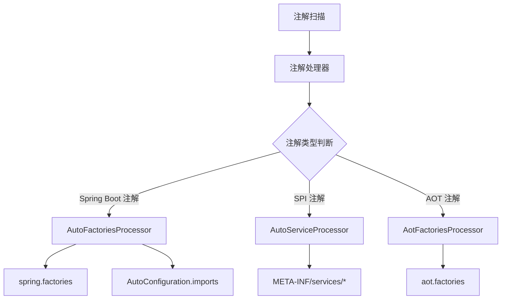

# Arco Processor - Spring Boot 注解处理器

## 项目概述

Arco Processor 是一个强大的编译时注解处理器，专为 Spring Boot 项目设计。它能够自动生成 Spring Boot 的自动配置文件和 Java SPI 服务配置文件，大大简化了
Spring Boot Starter 的开发工作。

## 核心特性

- 🚀 **自动配置生成**：自动生成 `META-INF/spring.factories` 和
  `META-INF/spring/org.springframework.boot.autoconfigure.AutoConfiguration.imports` 文件
- 🔧 **Java SPI 支持**：自动生成 `META-INF/services/` 目录下的 SPI 配置文件
- 🎯 **AOT 编译支持**：支持 Spring Boot 3.x 的 AOT（Ahead-of-Time）编译特性
- 🔄 **增量编译**：支持增量编译，合并已有配置
- 🛡️ **类型安全**：编译时验证，确保配置的正确性
- 📦 **零配置**：开箱即用，无需额外配置

## 架构设计



## 模块结构

```
arco-processor/
├── arco-processor-annotation/     # 注解定义模块
├── arco-processor-core/          # 核心处理器实现
└── arco-processor-sample/        # 使用示例
    ├── single-module/            # 单模块示例
    └── multi-module/             # 多模块示例
```

## 支持的注解

### Spring Boot 自动配置注解

| 注解                                | 用途             | 注册目标                            |
|-----------------------------------|----------------|---------------------------------|
| `@Component` 及其派生注解               | 自动配置类          | `EnableAutoConfiguration`       |
| `@AutoContextInitializer`         | 应用上下文初始化器      | `ApplicationContextInitializer` |
| `@AutoListener`                   | 应用监听器          | `ApplicationListener`           |
| `@AutoRunListener`                | Spring 应用运行监听器 | `SpringApplicationRunListener`  |
| `@AutoEnvPostProcessor`           | 环境后置处理器        | `EnvironmentPostProcessor`      |
| `@AutoFailureAnalyzer`            | 故障分析器          | `FailureAnalyzer`               |
| `@AutoConfigImportFilter`         | 配置导入过滤器        | `AutoConfigurationImportFilter` |
| `@AutoTemplateProvider`           | 模板可用性提供者       | `TemplateAvailabilityProvider`  |
| `@AutoConfigDataLoader`           | 配置数据加载器        | `ConfigDataLoader`              |
| `@AutoConfigDataLocationResolver` | 配置数据定位解析器      | `ConfigDataLocationResolver`    |

### Java SPI 注解

| 注解             | 用途             | 生成位置                         |
|----------------|----------------|------------------------------|
| `@AutoService` | Java SPI 服务提供者 | `META-INF/services/[接口全限定名]` |

### AOT 编译注解

| 注解                              | 用途                 | 注册目标                                    |
|---------------------------------|--------------------|-----------------------------------------|
| `@AotRuntimeHintsRegistrar`     | 运行时提示注册器           | `RuntimeHintsRegistrar`                 |
| `@AotBeanRegistration`          | Bean 注册 AOT 处理器    | `BeanRegistrationAotProcessor`          |
| `@AotBeanFactoryInitialization` | Bean 工厂初始化 AOT 处理器 | `BeanFactoryInitializationAotProcessor` |

### 控制注解

| 注解            | 用途            |
|---------------|---------------|
| `@AutoIgnore` | 忽略指定类，不进行自动处理 |

## 快速开始

### 1. 添加依赖

```xml
<dependencies>
    <!-- 注解定义 -->
    <dependency>
        <groupId>dev.dong4j</groupId>
        <artifactId>arco-processor-annotation</artifactId>
        <version>2.0.0-SNAPSHOT</version>
    </dependency>
</dependencies>

<!-- 注解处理器 -->
<build>
    <plugins>
        <plugin>
            <groupId>org.apache.maven.plugins</groupId>
            <artifactId>maven-compiler-plugin</artifactId>
            <configuration>
                <annotationProcessorPaths>
                    <path>
                        <groupId>dev.dong4j</groupId>
                        <artifactId>arco-processor-core</artifactId>
                        <version>2.0.0-SNAPSHOT</version>
                    </path>
                </annotationProcessorPaths>
            </configuration>
        </plugin>
    </plugins>
</build>
```

### 2. 创建自动配置类

```java
@AutoConfiguration
@ConditionalOnProperty(prefix = "my.starter", name = "enabled", havingValue = "true")
public class MyAutoConfiguration {

    @Bean
    public MyService myService() {
        return new MyService();
    }
}
```

### 3. 创建 SPI 服务

```java
// 服务接口
public interface PaymentService {
    PaymentResult processPayment(double amount, String currency);
}

// 服务实现
@AutoService(PaymentService.class)
public class AlipayService implements PaymentService {
    @Override
    public PaymentResult processPayment(double amount, String currency) {
        // 支付宝支付实现
        return new PaymentResult(true, "支付成功", "ALIPAY_123456");
    }
}
```

### 4. 编译项目

```bash
mvn clean compile
```

编译完成后，会自动生成配置文件：

```
target/classes/META-INF/
├── spring.factories
├── spring/
│   └── org.springframework.boot.autoconfigure.AutoConfiguration.imports
└── services/
    └── com.example.PaymentService
```

## 使用示例

### 自动配置示例

```java
@AutoConfiguration
@EnableConfigurationProperties(MyProperties.class)
public class DatabaseAutoConfiguration {

    @Bean
    @ConditionalOnMissingBean
    public DataSource dataSource(MyProperties properties) {
        return DataSourceBuilder.create()
                .url(properties.getUrl())
                .username(properties.getUsername())
                .password(properties.getPassword())
                .build();
    }
}
```

### 环境后置处理器示例

```java
@AutoEnvPostProcessor
public class CustomEnvironmentPostProcessor implements EnvironmentPostProcessor {

    @Override
    public void postProcessEnvironment(ConfigurableEnvironment environment,
                                     SpringApplication application) {
        // 添加自定义配置属性
        Map<String, Object> customProperties = new HashMap<>();
        customProperties.put("my.custom.property", "value");

        MapPropertySource propertySource = new MapPropertySource("custom", customProperties);
        environment.getPropertySources().addFirst(propertySource);
    }
}
```

### 应用监听器示例

```java
@AutoListener
public class CustomApplicationListener implements ApplicationListener<ApplicationReadyEvent> {

    @Override
    public void onApplicationEvent(ApplicationReadyEvent event) {
        System.out.println("应用启动完成：" + event.getTimeTaken().toMillis() + "ms");
    }
}
```

### 故障分析器示例

```java
@AutoFailureAnalyzer
public class DatabaseConnectionFailureAnalyzer extends AbstractFailureAnalyzer<SQLException> {

    @Override
    protected FailureAnalysis analyze(Throwable rootFailure, SQLException cause) {
        return new FailureAnalysis(
            "数据库连接失败：" + cause.getMessage(),
            "请检查数据库配置和网络连接",
            cause
        );
    }
}
```

## AOT 编译支持

对于 Spring Boot 3.x 项目，可以使用 AOT 相关注解：

```java
@AotRuntimeHintsRegistrar
public class MyRuntimeHintsRegistrar implements RuntimeHintsRegistrar {

    @Override
    public void registerHints(RuntimeHints hints, ClassLoader classLoader) {
        // 为 GraalVM 原生镜像注册运行时提示
        hints.reflection().registerType(MyClass.class, MemberCategory.INVOKE_PUBLIC_METHODS);
    }
}
```

## 配置选项

### 编译时选项

可以通过 Maven 编译器插件传递选项：

```xml
<plugin>
    <groupId>org.apache.maven.plugins</groupId>
    <artifactId>maven-compiler-plugin</artifactId>
    <configuration>
        <compilerArgs>
            <arg>-Adebug=true</arg> <!-- 启用调试日志 -->
        </compilerArgs>
    </configuration>
</plugin>
```

支持的选项：

- `debug`: 启用调试日志输出

## 高级特性

### 增量编译支持

注解处理器支持增量编译，会自动合并：

1. 用户手动编写的配置文件
2. 上次编译生成的配置文件
3. 当前编译新发现的配置

### 组合注解支持

支持 Spring 的组合注解特性：

```java
@Target(ElementType.TYPE)
@Retention(RetentionPolicy.RUNTIME)
@AutoConfiguration
@ConditionalOnWebApplication
public @interface WebAutoConfiguration {
}

@WebAutoConfiguration  // 会被识别为 @AutoConfiguration
public class MyWebAutoConfiguration {
    // ...
}
```

### 配置验证

处理器会在编译时验证：

- 服务提供者是否实现了声明的接口
- 配置类是否存在
- 注解使用是否正确

## 故障排除

### 常见问题

1. **配置文件未生成**
    - 检查注解处理器是否正确配置
    - 确保类路径中包含注解处理器
    - 查看编译日志是否有错误

2. **SPI 服务未生效**
    - 确保服务实现类有公开的无参构造函数
    - 检查类是否实现了声明的接口
    - 验证生成的配置文件内容

3. **自动配置未生效**
    - 检查 Spring Boot 版本兼容性
    - 确保配置类在正确的包路径下
    - 验证条件注解是否满足

### 调试技巧

1. **启用调试日志**：
   ```xml
   <compilerArgs>
       <arg>-Adebug=true</arg>
   </compilerArgs>
   ```

2. **查看生成的文件**：
   检查 `target/classes/META-INF/` 目录下的配置文件

3. **使用 IDE 调试**：
   在 IDE 中查看注解处理器的输出日志

## 性能考虑

- 注解处理器仅在编译时运行，不影响运行时性能
- 支持增量编译，减少重复处理
- 生成的配置文件体积小，加载速度快

## 兼容性

- **Java 版本**：Java 8+
- **Spring Boot 版本**：2.0+
- **Maven 版本**：3.6+
- **Gradle 版本**：6.0+

## 版本历史

### 2.0.0-SNAPSHOT

- 重构代码架构，提升性能
- 新增 AOT 编译支持
- 完善文档和示例
- 支持更多 Spring Boot 扩展点

## 贡献指南

欢迎贡献代码！请遵循以下步骤：

1. Fork 项目
2. 创建特性分支
3. 提交变更
4. 创建 Pull Request

## 许可证

本项目基于 MIT 许可证开源，详见 [LICENSE](LICENSE) 文件。

## 联系方式

- **项目主页**：https://github.com/zeka-stack/arco-processor
- **问题反馈**：https://github.com/zeka-stack/arco-processor/issues
- **邮箱**：dong4j@gmail.com

---

<div align="center">
    <p>如果这个项目对你有帮助，请给我们一个 ⭐️</p>
</div>
